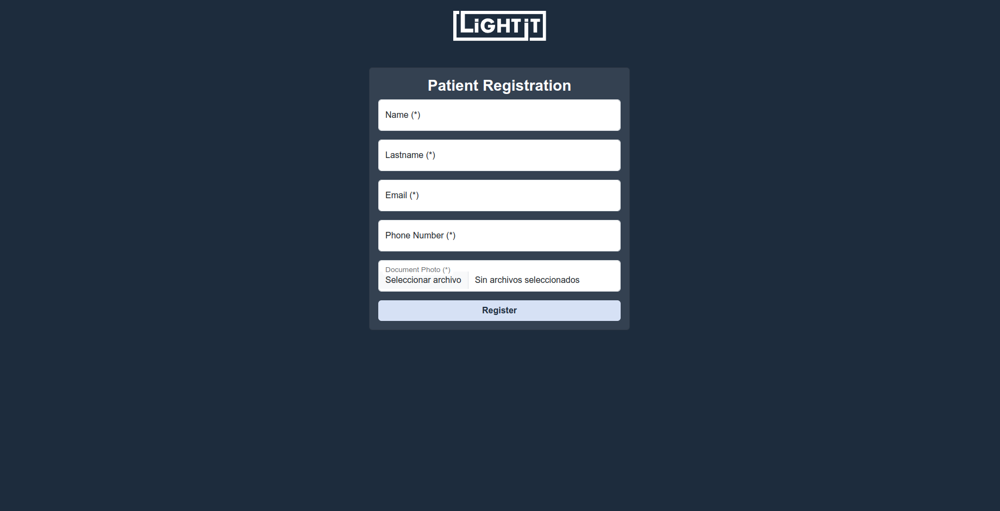
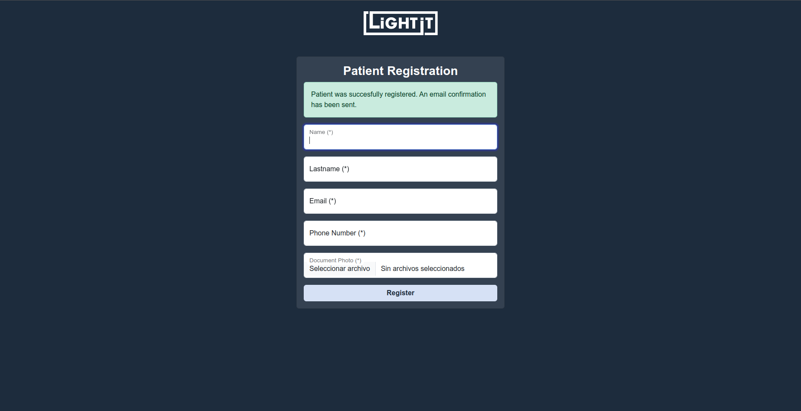

<div id="top"></div>

# Patient Registration App
It is an application that allows the registration of patients and the sending of a registration confirmation via email. 
The patient's record along with their document photo is saved in a database.
<br>

## Screenshots




<p align="right">(<a href="#top">volver a inicio</a>)</p>

<br>

## Requirements
* [PHP 8.0](https://www.php.net/downloads.php) or higher
* [NPM 8.0](https://docs.npmjs.com/getting-started) or higher
* [MySQL](https://www.mysql.com/downloads/)
* [Composer 2.1](https://getcomposer.org/download/) or higher

<p align="right">(<a href="#top">volver a inicio</a>)</p>

<br>

## Installation (Linux)
1. Clone the app repository to the directory of your choice
   ```sh
   git clone git@github.com:Alaneta/patients-registration-app.git
   ```

2. Instalar las dependencias de la aplicación
   ```sh
   composer install
   ```

3. Install application dependencies
   ```sh
   composer update
   ```

4. Create the environment variables file
   ```sh
   cp .env.example .env
   ```

5. Replace the database connection and mail provider information in the .env file

   You can get and email testing account from https://mailtrap.io/
   ```sh
    DB_CONNECTION=mysql
    DB_HOST=mysql
    DB_PORT=3306
    DB_DATABASE=patients_registration_app
    DB_USERNAME=sail
    DB_PASSWORD=password
   
    MAIL_MAILER=smtp
    MAIL_HOST=smtp.mailtrap.io
    MAIL_PORT=2525
    MAIL_USERNAME={your_mailtrap_username}
    MAIL_PASSWORD={yoor_mailtrap_password}
    MAIL_ENCRYPTION=tls
   ```
   The default username and password for the database are:
   > usuario: sail
   > contraseña: password

6. Generate the APP_KEY env variable
   ```sh
   php artisan key:generate
   ```

7. Start containers in unattended mode
    ```sh
    ./vendor/bin/sail up -d
    ```
8. Install required dependencies from node
    ```sh
    ./vendor/bin/sail npm install
    ```
9. Generate database tables from migrations
    ```sh
    ./vendor/bin/sail php artisan migrate
    ```

Now the application will be running on localhost: http://localhost/

<p align="right">(<a href="#top">volver a inicio</a>)</p>

<br>

## Starting and Stopping Containers
To start all containers
```sh
./vendor/bin/sail up
```

To start all containers in unattended mode
```sh
./vendor/bin/sail up -d
```

To stop all containers
```sh
./vendor/bin/sail stop
```

To eliminate volumes
```sh
./vendor/bin/sail down -v
```

<p align="right">(<a href="#top">volver a inicio</a>)</p>

<br>

## Built with:
| [](https://laravel.com/) | [](https://www.php.net/) | [](https://www.mysql.com/) | [](https://getcomposer.org/) | [](https://sass-lang.com/) | [](https://jquery.com/) | [](https://getbootstrap.com/) |
|------------------------------------------------------------------------------|-------------------------------------------------------------------|-------------------------------------------------------------------------|-------------------------------------------------------------------------------|-----------------------------------------------------------------------|------------------------------------------------------------------------|--------------------------------------------------------------------------------------|

<p align="right">(<a href="#top">volver a inicio</a>)</p>

<br>

## Author
* **Alan Camussi** - Full Stack Developer - [Alaneta](https://github.com/Alaneta)

<p align="right">(<a href="#top">volver a inicio</a>)</p>

<br>
